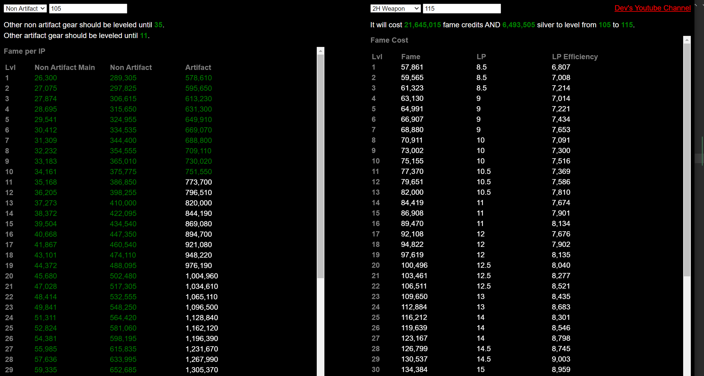

# Albion Fame

A [tool](https://mahhov.github.io/albion-fame/) to help plan your combat specs.

Now that everyone is fame farming, maybe some of you are wondering whether it's better to get e.g. elite level 120 on your main gear, or level up the other gear. Or when you should use your learning points. Or how much fame credits you need to max everything out.

- The left side shows the efficient levels for each gear to maximize IP/fame.
    - E.g., You get more IP/fame leveling your artifact gear up to 11 than leveling your main non artifact gear past 105.
- The right side shows the fame, fame credit, learning point, and silver costs of leveling.

